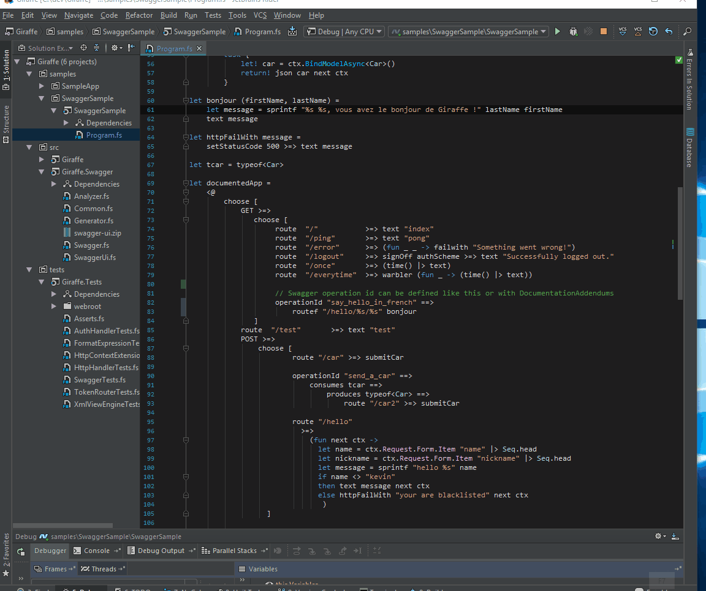

# SwaggerForFsharp

Swagger for F# project is destinated to produce libraries generating Swagger's documentation with REST frameworks like Giraffe and Suave.


## Swagger for Giraffe

### History

In this project I propose a solution to generate a swagger for Giraffe. 
Issue https://github.com/giraffe-fsharp/Giraffe/issues/79 has label `help wanted` 😃  .
Contributing direclty to Giraffe seems to be less reactive than creating my own project (see [PR #218](https://github.com/giraffe-fsharp/Giraffe/pull/218) )

[My solution for Suave](https://rflechner.github.io/Suave.Swagger/) was effectively not really easy to use.
Documentation and service implementation were too strongly coupled and the DSL was really verbose.

The good news is that we still have to declare our API routes the same way as before but to enable the route analysis we have to surround the app declaration with quotation marks.

With that in place we can decouple the app declaration from the analysis required to generate the swagger documentation. In other words this solution has the avantage to avoid corrupting your service implementation.

### How does it work ?

I introduced the `documents` function that takes two arguments:
1. the quotation expression containing webservice implementation.
2. a `DocumentationConfig` argument.

This function does the analysis of your quotation to generate Swagger documentation.

`DocumentationConfig` contains the following properties:

- `MethodCallRules`: allow you to provide custom functions to enrich DSL and / or quotation analysis.
- `DocumentationAddendums`: allow you to add more informations to the documentation without introducing service implementation modification.

I introduced `==>` operator that gives the possibility to add `decorations` in routes implementations.

### Examples

There are 2 solutions to add documentation for a route.

[See example](./src/samples/Giraffe.Swagger.Sample/Program.fs)

- [First one](./src/samples/Giraffe.Swagger.Sample/Program.fs#L183)

```fsharp
...
operationId "send_a_car" ==>
	consumes tcar ==>
		produces typeof<Car> ==>
			route "/car2" >=> submitCar
...
```

- [Second one](./src/samples/Giraffe.Swagger.Sample/Program.fs#L181)

using `DocumentationAddendums`

```fsharp
...
route "/car" >=> submitCar
...

let docAddendums =
    fun (route:Analyzer.RouteInfos) (path:string,verb:HttpVerb,pathDef:PathDefinition) ->
        match path,verb,pathDef with
        | "/car", HttpVerb.Post,def ->
            let ndef = 
                (def.AddConsume "model" "application/json" Body typeof<Car>)
                    .AddResponse 200 "application/json" "A car" typeof<Car>
            path, verb, ndef
...
```

### Next steps

#### SwaggerUi

In futur, SwaggerUi could be a submodule of the repository (if you like and accept this PR 😄  ).

#### Quotations and Giraffe

Some features could be missing and some quotations could be difficult to parse.
For the moment, analyzer works with most basics [default httphandlers](https://github.com/giraffe-fsharp/Giraffe#default-httphandlers).

I only implemented:

- GET
- POST
- PUT
- PATCH
- DELETE
- route
- routeCi
- routef
- setStatusCode
- text
- json
- choose
- subRouteCi
- subRoute

You can build and run [SwaggerSample/Program.fs](./src/samples/Giraffe.Swagger.Sample/Program.fs) and 
 go to http://localhost:5000/swaggerui/



#### Suave

Next step will consist to add genericity and implement a version for Suave.io

